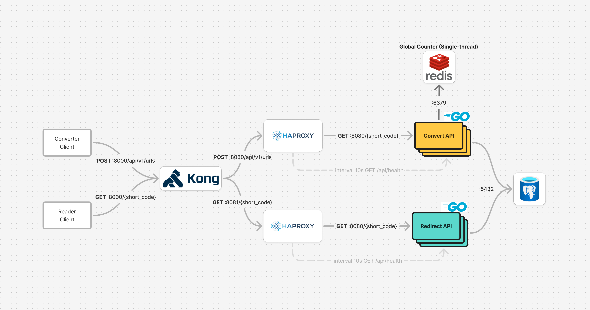

# Scalable URL Shortener

A production-ready, scalable URL shortener service built with microservices architecture using Go, PostgreSQL, Redis, HAProxy, and Kong API Gateway.

## 🏗️ Architecture Overview

This URL shortener implements a distributed microservices architecture with the following components:

- **Convert API**: Handles URL shortening (creates short codes from long URLs)
- **Redirect API**: Handles URL redirection (redirects short codes to original URLs)
- **PostgreSQL**: Persistent storage for URL mappings
- **Redis**: Global auto-incrementing counter for unique ID generation
- **HAProxy**: Load balancer with health checks and failover
- **Kong**: API Gateway for routing and management
- **Redis Commander**: Web-based Redis monitoring interface

## 🚀 Features

- **High Availability**: Multiple replicas (2 convert-api, 4 redirect-api instances)
- **Load Balancing**: HAProxy with round-robin distribution and health checks
- **Unique ID Generation**: Redis-based global counter ensuring uniqueness across instances
- **Base62 Encoding**: Efficient short code generation
- **Health Monitoring**: Built-in health check endpoints
- **Web Console**: Redis Commander for monitoring and debugging
- **Multiple Deployment Options**: Docker Compose, Kubernetes, AWS Lambda

## 🛠️ Technology Stack

- **Backend**: Go (Golang) with Gin framework
- **Database**: PostgreSQL 15 with optimized indexes
- **Cache/Counter**: Redis 7 with persistence
- **Load Balancer**: HAProxy 3.2.4
- **API Gateway**: Kong (latest)
- **Containerization**: Docker & Docker Compose
- **Orchestration**: Kubernetes manifests included
- **Cloud**: AWS CloudFormation for serverless deployment

## 📋 Prerequisites

- Docker and Docker Compose
- Go 1.21.3+ (for local development)
- PostgreSQL (for local development)
- Redis (for local development)

## 🚀 Quick Start

### Using Docker Compose (Recommended)

1. Clone the repository:

```bash
git clone https://github.com/peemtanapat/scalable-url-shortener.git
cd scalable-url-shortener
```

2. Start all services:

```bash
docker-compose up -d
```

3. Verify services are running:

```bash
docker-compose ps
```

### Service Endpoints

| Service           | Endpoint              | Purpose                        |
| ----------------- | --------------------- | ------------------------------ |
| API Gateway       | http://localhost:8000 | Main entry point               |
| Convert API (LB)  | http://localhost:8080 | URL shortening                 |
| Redirect API (LB) | http://localhost:8081 | URL redirection                |
| Kong Admin        | http://localhost:8002 | API Gateway admin              |
| Redis Commander   | http://localhost:8088 | Redis monitoring (admin/admin) |

## 📖 API Documentation

### Create Short URL

**POST** `http://localhost:8000/api/v1/urls`

```json
{
  "originalUrl": "https://www.example.com/very-long-url"
}
```

**Response:**

```json
{
  "shortUrl": "http://localhost:8000/G80003UE",
  "shortCode": "G80003UE",
  "originalUrl": "https://www.example.com/very-long-url",
  "id": 1
}
```

### Redirect Short URL

**GET** `http://localhost:8000/{shortCode}`

Returns a 302 redirect to the original URL.

### Health Check

**GET** `http://localhost:8000/api/health`

Returns service health status.

## 🏗️ Service Architecture




## 🔧 Configuration

### Environment Variables

| Variable       | Description                  | Default                |
| -------------- | ---------------------------- | ---------------------- |
| `REDIS_URL`    | Redis connection string      | `redis:6379`           |
| `DATABASE_URL` | PostgreSQL connection string | See docker-compose.yml |
| `INSTANCE_ID`  | Unique instance identifier   | `${HOSTNAME}`          |

### Database Schema

The PostgreSQL database includes:

- `urls` table with indexes on `short_code` and `created_at`
- Automatic `updated_at` timestamp triggers
- Optimized for fast lookups and analytics

## 🚀 Deployment Options

### 1. Docker Compose (Development/Testing)

```bash
docker-compose up -d
```

### 2. Kubernetes

```bash
kubectl apply -f k8s/
```

### 3. AWS Serverless

```bash
aws cloudformation deploy --template-file redirect-api-v1-aws-cloudformation.yaml --stack-name url-shortener
```

## 📊 Monitoring & Debugging

### Redis Commander

- **URL**: http://localhost:8088
- **Credentials**: admin/admin
- Monitor the `url_counter` key
- View Redis statistics and execute commands

### Health Checks

All services include health check endpoints:

- Convert API: `GET /api/health`
- Redirect API: `GET /api/health`

### Logs

```bash
# View all service logs
docker-compose logs -f

# View specific service logs
docker-compose logs -f convert-api
docker-compose logs -f redirect-api
```

## 🔄 Load Balancing

HAProxy configuration includes:

- **Health Checks**: `GET /api/health` every 10 seconds
- **Failover**: 3 failed checks mark server as down
- **Recovery**: 2 successful checks mark server as up
- **Algorithm**: Round-robin distribution
- **Timeouts**: 5s connect, 20s client/server

## 🧪 Testing

### Manual Testing

Use the provided HTTP client files:

```bash
# Test convert API
curl -X POST http://localhost:8000/api/v1/urls \
  -H "Content-Type: application/json" \
  -d '{"originalUrl": "https://www.example.com"}'

# Test redirect
curl -I http://localhost:8000/{shortCode}
```

### Client Files

- `convert-api/client.http` - Convert API test requests
- `redirect-api/client.http` - Redirect API test requests

## 🛡️ Security Considerations

- **Database**: Use strong passwords in production
- **Redis**: Configure authentication for production
- **API Gateway**: Implement rate limiting via Kong plugins
- **Network**: Use private networks for inter-service communication

## 📈 Performance Optimizations

- **Database Indexes**: Optimized for fast short code lookups
- **Redis Persistence**: AOF enabled for durability
- **Load Balancing**: Multiple replicas with health checks
- **Connection Pooling**: Built into Go database drivers

## 🔮 Future Enhancements

- [ ] Analytics and click tracking
- [ ] Custom short codes
- [ ] Expiration dates for URLs
- [ ] Rate limiting
- [ ] Batch URL creation
- [ ] REST API documentation with Swagger
- [ ] Prometheus metrics integration
- [ ] Grafana dashboards
